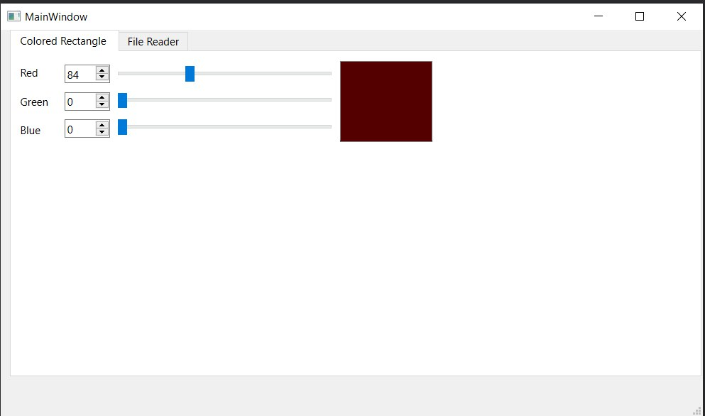
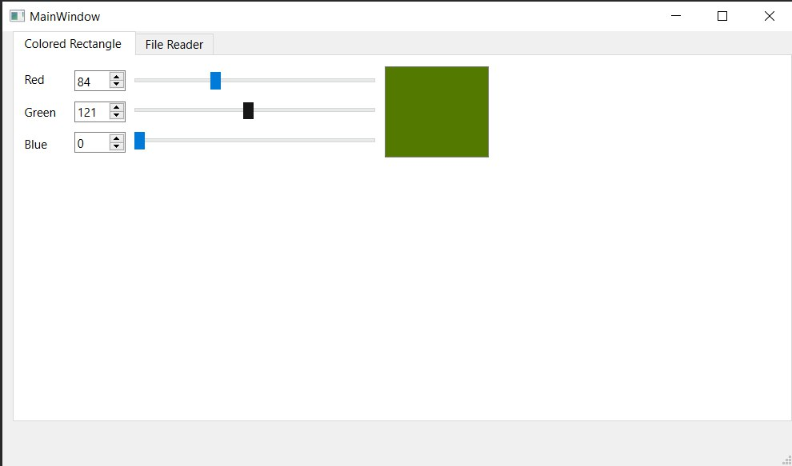
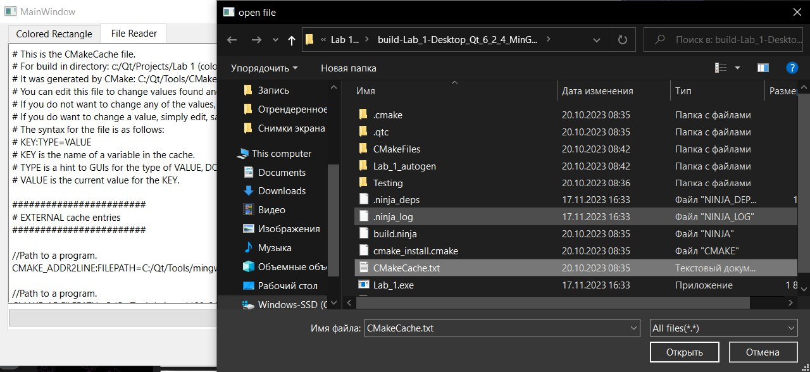
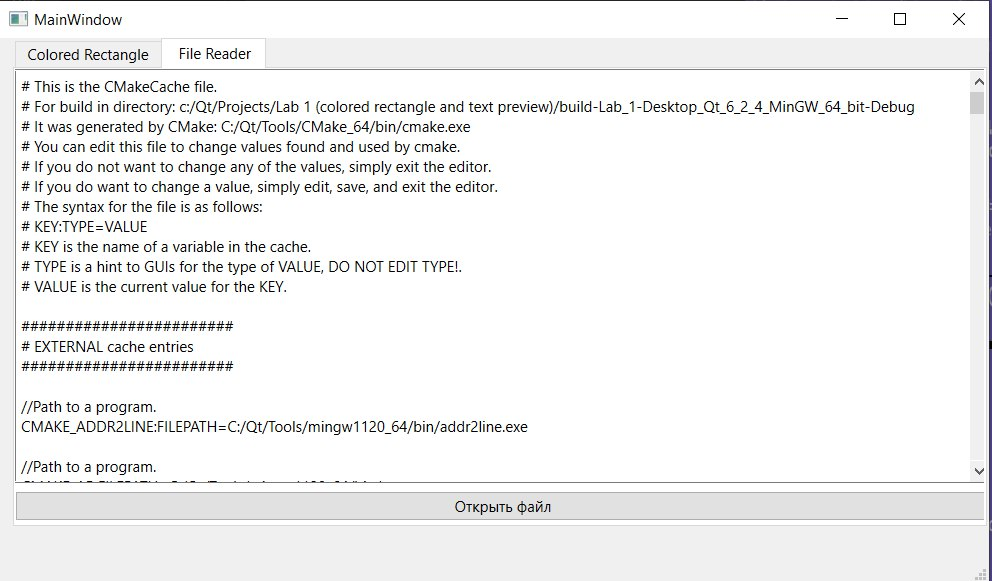

# Отчет по лабораторной работе №1

## Использование библиотеки элементов графического интерфейса Qt

## Вариант №5

`Зейденс Никита Вячеславович (ПО-9)`

## Цель лабораторной работы

Научиться использовать библиотеку элементов графического интерфейса Qt.

## Задание *(4 балла)*

* пользуясь примером в каталоге lab08/02, создайте приложение с графическим интерфейсом, аналогичным представленному ---сверху---

* используйте классы QLabel, QSpinBox, QSlider, QPlainTextEdit.

## Знакомство с элементами интерфейса: добавим функциональность. *(3 балла)*

* Добавим функциональность созданному на предыдущем этапе приложению:

  * спин-боксы и слайдеры будут перемещаться синхронизировано в диапазоне значений от 0 до 255.

  * Цвет фона QPlainTextEdit будет меняться соответственно

* Выполнение:

  * Выставляем диапазон допустимых значений для QSpinBox и QSlider при помощи методов setMinimum() и setMaximum()

  * запрещаем ввод в текстовое поле: setEnabled(false)

  * Реализуем метод setColor() и слоты setRed(int), setGreen(int), setBlue(int)

  * к слотам подключаем сигналы QSlider::sliderMoved() и QSpinBox::valueChanged()

  * в реализации слотов синхронизируем значения слайдера и спин-бокса и вызываем setColor()

* Для изменения цвета фона текстового поля воспользуемся таблицами стилей для описания стиля элементов.

  * таблицы стилей используют синтаксис CSS

  * будем задавать цвет в виде строки типа #rrggbb

  * таким образом, надо задать QPlainTextEdit следующий стиль:

  * QPlainTextEdit { background: #rrggbb; }

  * задаём стиль при помощи метода setStyleSheet() (таблица стиля передаётся в виде строки).

## Диалоги *(3 балла)*

Библиотека графических элементов Qt предлагает набор из нескольких полнофункциональных диалоговых окон, позволяющих выполнять некоторые стандартные операции. Среди них такие, как выбор файла в файловой системе, выбор шрифта, выбор цвета, диалог печати и некоторые другие. Мы рассмотрим в настоящей работе пример использования диалога выбора файла - QFileDialog.

**Создаём простейший обозреватель текстовых файлов.**

* Создайте новый виджет и поместите на него элемент QTextEdit.

* Добавьте кнопку QPushButton и подключите её сигнал clicked() к слоту openFile()

* Реализуйте в слоте выбор имени файла пользователем: QFileDialog::getOpenFileName()

* Откройте QFile в соответствии с выбранным названием

* Прочитайте его содержимое и поместите в виде текста в элемент QTextEdit

## Код программы

Код программы [mainwindow.cpp](./src/mainwindow.cpp).

Демонстрация кода программы в README.md невозможна из-за проверки на дупликацию кода.

Остальные файлы созданы с помощью шаблона Qt.

## Пример работы программы

1. Окно выбора цвета, один из цветов
   

2. Окно выбора цвета, второй выбор цвета
   

3. Окно выбора файла
   

4. Окно с открытым файлом
   
