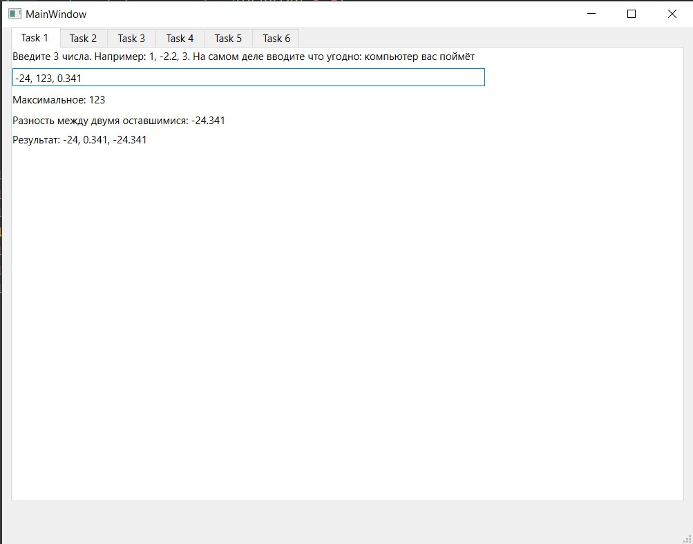
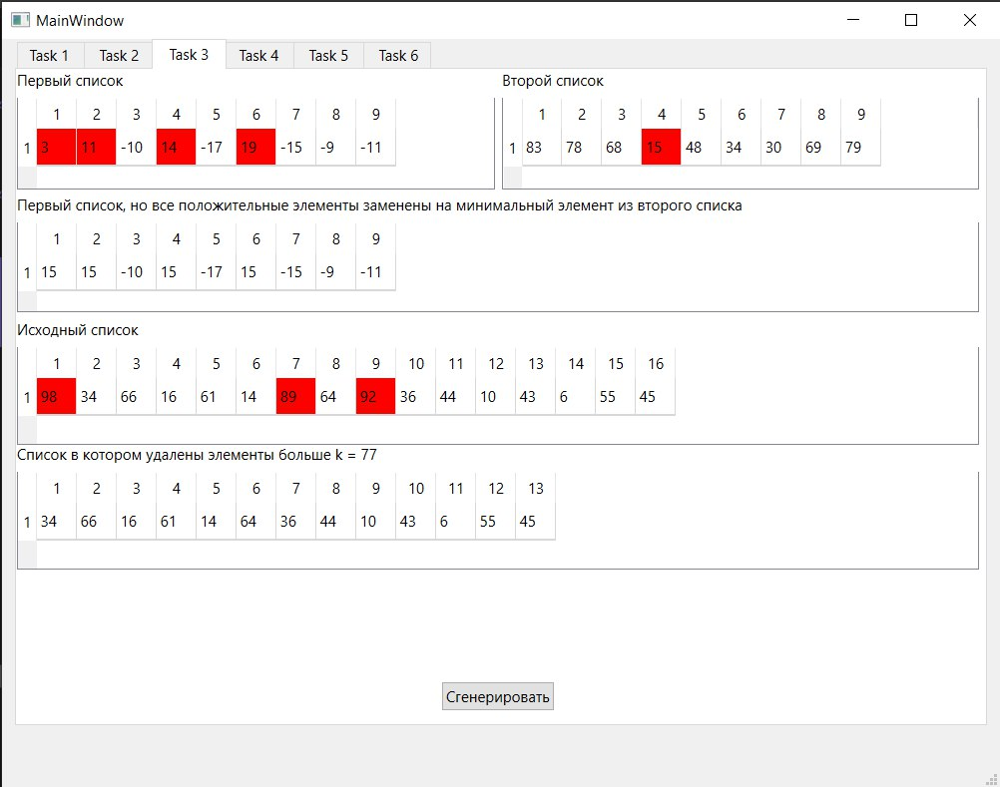
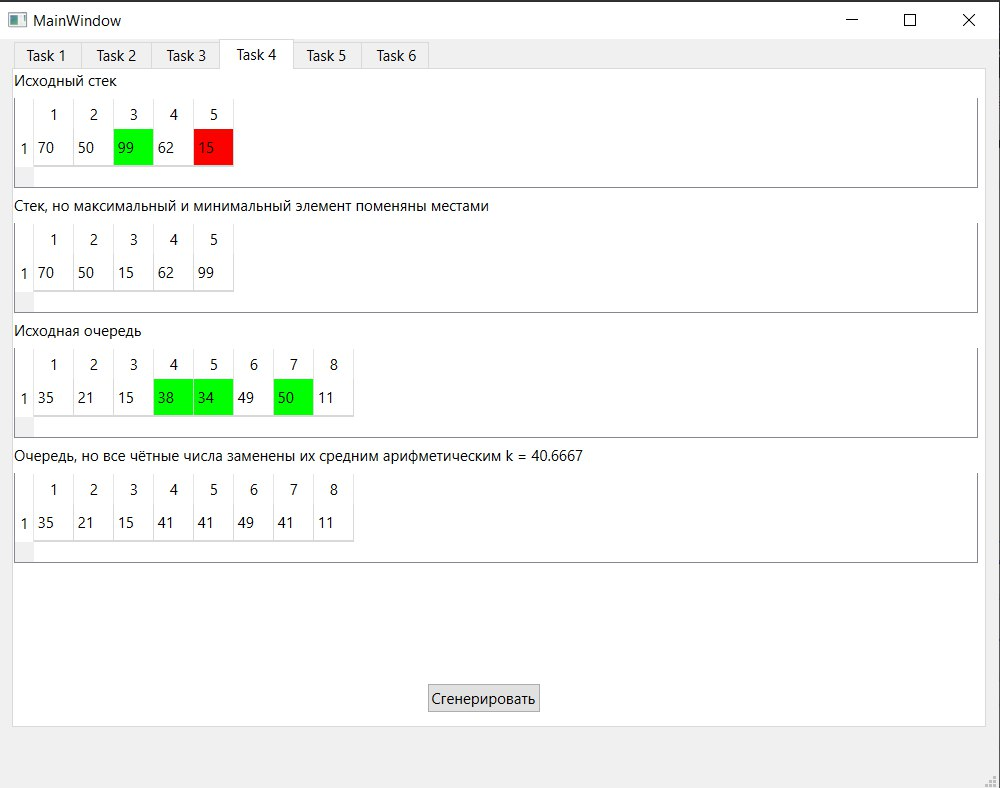
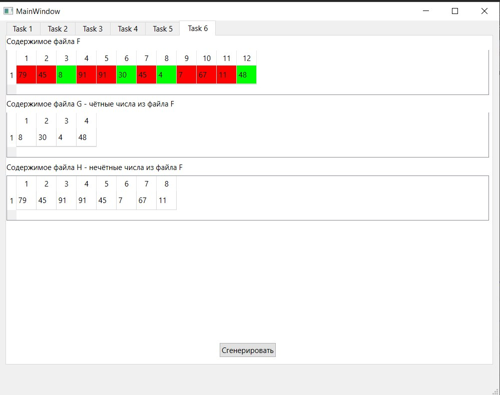

# Лабораторная работа №3

## Контейнеры в Qt5

## Вариант 5

`Зейденс Никита Вячеславович ПО-9`

## Цель лабораторной работы

Научиться использовать контейнеры в Qt

## Ход работы

Файлы проекта с кодом:

- [main.cpp](./src/main.cpp)
- [mainwindow.cpp](./src/mainwindow.cpp)
- [mainwindow.h](./src/mainwindow.h)
- [mainwindow.ui](./src/mainwindow.ui)

## Задания

### Задание 1, Вариант 5

Формулировка

- Заменить наибольшее из трёх чисел (числа вводятся в lineedit) разностью двух
других чисел и вывести результат в label

Результат работы

### Задание 2, Вариант 5

Формулировка

1. Дан целочисленный массив размера N. Вывести вначале все его четные элементы,
а затем − нечетные, сохраняя порядок следования элементов.
2. Дана матрица размера m x n. Преобразовать матрицу, поменяв местами минимальный
и максимальный элемент в каждой строке

Результат работы

### Задание 3, Вариант 5

Формулировка

1. Заполнить 2 списка случайными элементами и заменить все положительные
элементы первого списка на значение минимального из второго списка.
2. Заполнить связный список случайными элементами. Удалить из списка все
элементы, длина которых больше k.

Результат работы

### Задание 4, Вариант 5

Формулировка

1. Сформировать стек из 5 чисел. Поменять местами максимальный и
минимальный элементы стека.
2. Заполнить очередь 8 случайными числами из интервала
[0; 50]. Заменить все четные числа их средним арифметическим значением.

Результат работы

### Задание 5, Вариант 5

Формулировка

- В озере водится несколько видов рыб. Три рыбака поймали рыб,
представляющих некоторые из имеющихся видов. Определить, какие виды
рыб есть у каждого рыбака, какие рыбы есть в озере, но нет ни у одного из
рыбаков

Результат работы

### Задание 6, Вариант 5

Формулировка

- Дан файл f, компоненты которого являются целыми числами.
Запишите в файл g все чётные числа файла f, а в файл h - все нечётные.
Порядок следования чисел сохранить

Результат работы

## Вывод

Научились использовать на практике контейнеры в Qt.
